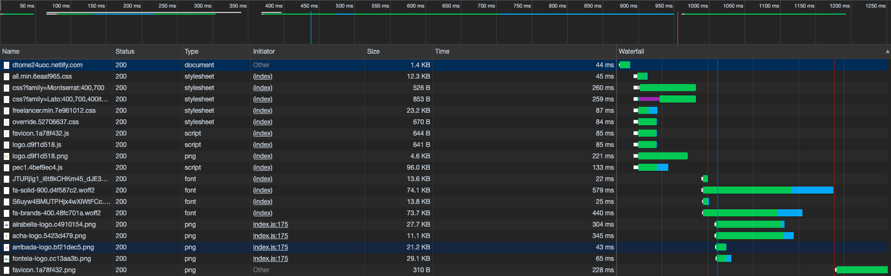

## PEC 3

### Test de Google PageSpeed Insights

El primer test de PageSpeed Insights nos da unas marcas de:

* En móvil:


* En ordenador:


Como podemos ver, para ordenador tenemos un muy buen valor de rendimiento de la página web. Veremos más adelante si podemos 
mejorarlo para obtener el 100%. En cambio, para móvil, tenemos márgen de mejora ya que el actual valor es de 76%.

También en el apartado móvil podemos ver que los valores relacionados con el tiempo que pasa desde que hacemos la petición hasta que vemos algo está en naranja.
Esto nos indica que el tiempo de espera para que el usuario pueda ver algo en el navegador es moderado y que, por lo tanto, 
podemos mejorar este tiempo para que el usuario no tenga la sensación de que la web va lenta o no le carga. 

También podemos ver en la herramienta de desarrolladores de Chrome lo siguiente:



Aquí vemos que primero se cargan los CSS, los ficheros JS necesarios para la web y algunas imagenes. Podemos apreciar que
cuando cargamos las fuentes (fa-brands y fa-solid) ek tuenoi qye tarda es de los más elevados. Quizás por este lado podamos
recortar tiempo eliminando las fuentes o viendo si realmente son necesarias. También podemos ver que estamos descargando múltiples 
ficheros CSS de la web. Aquí también podemos ver si uniéndolos y minificandolos podemos ganar algo de tiempo.

### Primera iteración

En la primera iteración vamos a revisar los ficheros de fuentes usados por nuestra web y a intentar reducir el coste que nos supone
el tenerlos.

Si revisamos el `index.html` podemos ver que tenemos dos peticiones a las fuentes de Google:

```html
<link href="https://fonts.googleapis.com/css?family=Montserrat:400,700" rel="stylesheet" type="text/css">
<link href="https://fonts.googleapis.com/css?family=Lato:400,700,400italic,700italic" rel="stylesheet" type="text/css">
```

Una forma de optimizar estas dos peticiones es uniéndolas en una única. Para ello podemos usar la pipe en el nombre de 
las fuentes, quedándonos algo tal que:

```html
<link href="https://fonts.googleapis.com/css?family=Montserrat:400,700|Lato:400,700,400italic,700italic" rel="stylesheet" type="text/css">
```

Con esta mejora, si volvemos a revisar la herramienta de Chrome para la red podemos ver que hemos conseguido bajar de 
200ms cada petición y 1KB aproximado de descarga a 60ms y 700KB.


Lo siguiente a revisar de fuentes son los ficheros de FontAwesome  (fa-*). He podido ver que tenemos dos ficheros de 
fuentes que se nos descargan: Los encargados de los iconos sociales (Twitter, Facebook, etc) y los iconos sólidos (para 
la estrella situada debajo del título Familias). Creo que mantener un fichero de iconos para una simple estrella no es lógico,
así que optaré por cambiar este icono. En la [documentación de FontAwesome](https://fontawesome.com/how-to-use/on-the-web/setup/hosting-font-awesome-yourself#using-certain-styles)
podemos ver un ejemplo de como cargar solamente ciertos estilos que usemos. Por lo tanto los cambios que haré serán:
* Modificar el icono de la estrella por otro (o eliminarlo).
* Cargar solamente lo necesario.


Para cargar solamente aquello que uso lo haré de la siguiente forma en el <head>:
```html
    <link href="node_modules/@fortawesome/fontawesome-free/css/fontawesome.min.css" rel="stylesheet" type="text/css">
    <link href="node_modules/@fortawesome/fontawesome-free/css/brands.min.css" rel="stylesheet" type="text/css">
```


### Repositorio y URL pública

* Podemos encontrar el proyecto en [Github](https://github.com/danitome24/master-html-css-tools)
* Url pública de la web: https://dtome24uoc.netlify.com/

### Autor

Daniel Tomé Fernández <dtome24@uoc.edu>
