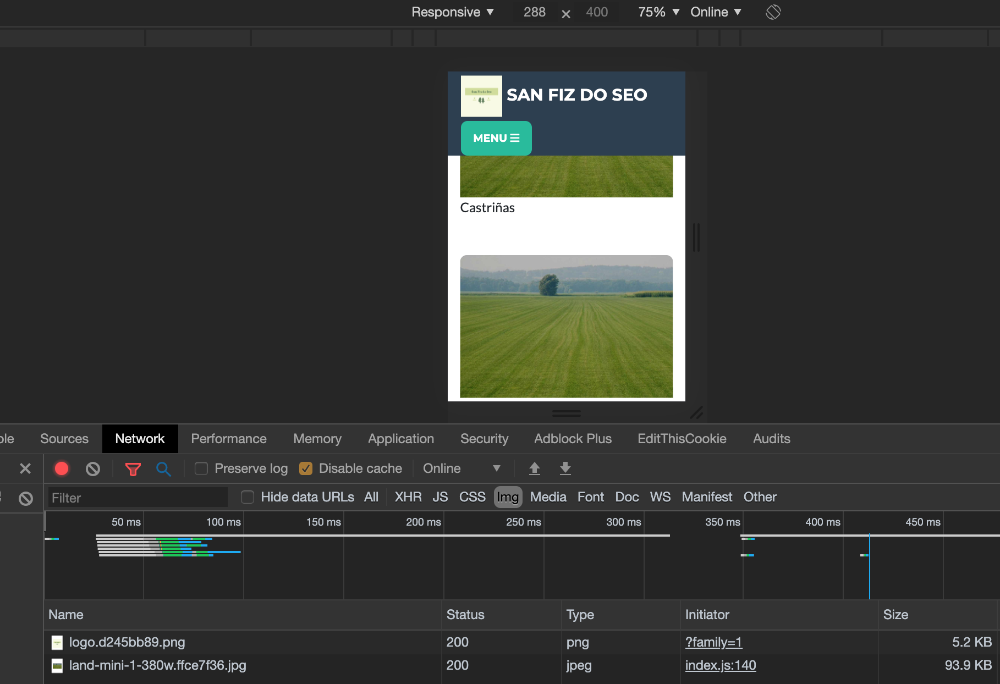
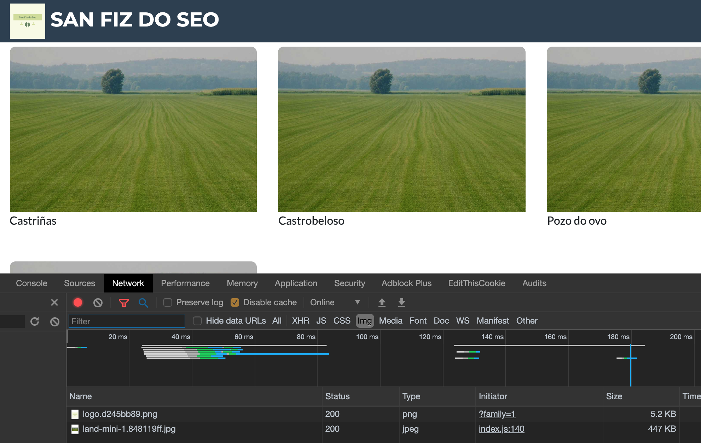
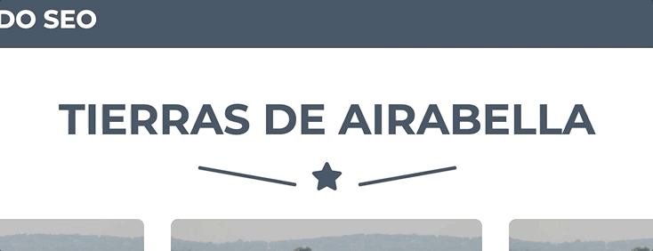
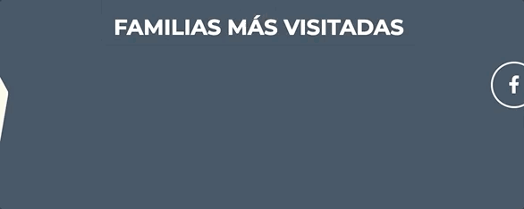
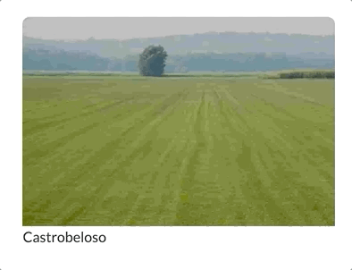
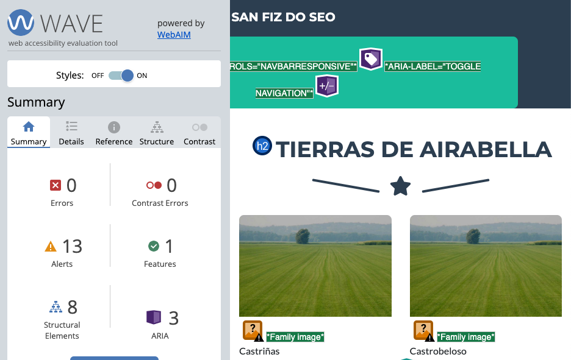

## PEC 2

## Logotipo

El logotipo lo he creado con la herramienta online [hatchful](https://hatchful.shopify.com/). Ya que la temática de esta página
web va sobre tierras, pues en el logo se me ha ocurrido incorporar árboles para referenciar a la parte de la naturaleza.

## Imagen editada con clip-path

He integrado el logo en el footer editado con clip-path. La forma que he creado ha sido un polígono de siete lados donde la base
es el lado más largo. Para crear este polígono he usado la herramienta [clippy](https://bennettfeely.com/clippy/) que me ayuda a 
crear, online, polígonos clip-path vía clics y puntos.

## Página de detalle

### Imagen destacada

En la PEC-1 ya introduje una imagen destacada del terreno y en esta práctica lo que he hecho ha sido tratarla con dirección de arte,
para ello he creado dos imágenes principales llamadas: `land2.png` i `land2-mini.png`. La primera imagen (grande) se mostrará en pantallas con 
mayor anchura de 769px i la segunda se mostrará cuando la anchura es menor a 768px.

El formato de esta imagen es en `.png` ya que la imagen principal de la página debe tener una buena resolución.

### Otras imágenes

Como en la imagen destacada, en la PEC-1 también añadí tres imagenes de tierras similares. Estas imágenes las he creado en formato 
`.jpg` ya que al ser imágenes más pequeñas, no requiren de tanta resolución.

## Página de categoría

En la página de categoría (en mi caso es el listado de tierras de una família), también tenía hecho de la práctica anterior que por cada tierra se
muestre una imagen. Para estas imágenes he usado la técnica de responsive. He creado dos imágenes una: `land-mini-1.jpg` y `land-mini-1-380w.jpg`.
La primera con una anchura de 1138px de ancho y la segunda 380 px.

## Responsive

Al usar una plantilla basada en Bootstrap y usar el mismo framework para los estilos, que la página sea responsive ya va por defecto. 
Igualmente, tal y como he mencionado antes, he usado técnicas de imágenes responsive y compresión de imágenes gracias a imagemin.

## Animaciones

He integrado tres animaciones a la página: una en el título 

 otra animación en el footer con el listado de famílias más visitadas.

y otra en las imágenes del listado de tierras

 

## Accesibilidad

La gestión del proyecto de accesibilidad la he revisado con el plugin de Chrome [Wave Evaluation Tool](http://wave.webaim.org/). He usado un plugin
dada su facilidad de uso en el desarrollo. Sencillamente con activarlo en la página que estoy visitando me muestra un report
con los errores que hay en la página actual. 

He hecho el seguimiento de todas las páginas y he eliminado todos y cada uno de los errores que Wave me ha indicado. Por lo tanto,
el sitio web cumple con las buenas prácticas de accesibilidad.

## Imágenes usadas

Todas las imágenes usadas en esta práctica han sido o creadas por mi o obtenidas de Google imagenes con licencia para reutilización.

### Deploy en producción

Para deployear el proyecto y tenerlo listo para producción simplemente deberemos cambiar el comando en el fichero `docker-compose.yml`
y donde ponga `npm run dev` hay que poner `npm run build`. Esto nos generará los JS, CSS y HTML preparados para subir a nuestro servidor de producción.

### Repositorio y URL pública

* Podemos encontrar el proyecto en [Github](https://github.com/danitome24/master-html-css-tools)
* Url pública de la web: https://dtome24uoc.netlify.com/

### Autor

Daniel Tomé Fernández <dtome24@uoc.edu>
