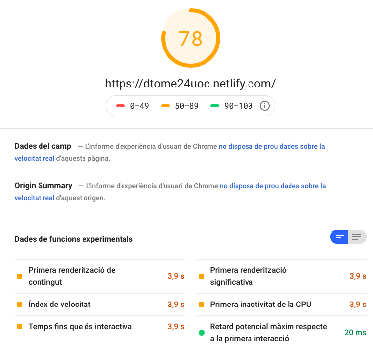
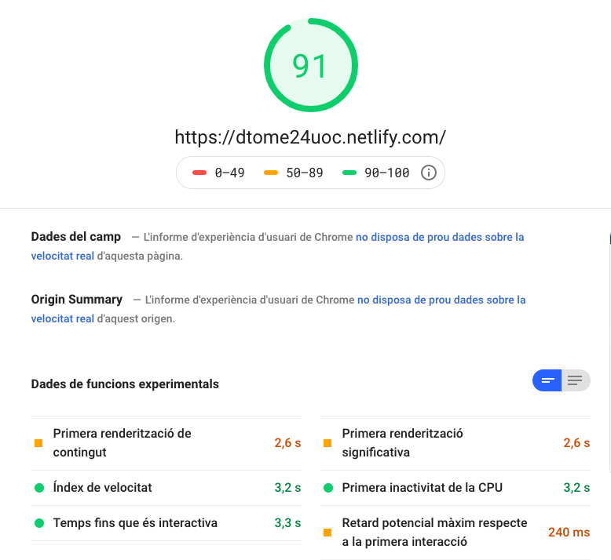
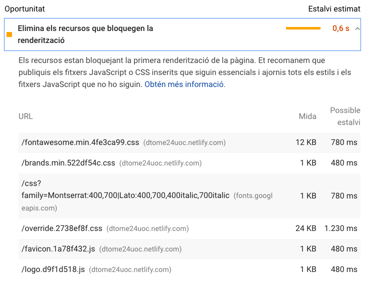

# PEC 3

## Test de Google PageSpeed Insights

El primer test de PageSpeed Insights nos da unas marcas de:

* En móvil:



* En ordenador:


Como podemos ver, para ordenador tenemos un muy buen valor de rendimiento de la página web. Veremos más adelante si podemos 
mejorarlo para obtener el 100%. En cambio, para móvil, tenemos margen de mejora ya que el actual valor es de 76%.

También en el apartado móvil podemos ver que los valores relacionados con el tiempo que pasa desde que hacemos la petición hasta que vemos algo está en naranja.
Esto nos indica que el tiempo de espera para que el usuario pueda ver algo en el navegador es moderado y que, por lo tanto, 
podemos mejorar este tiempo para que el usuario no tenga la sensación de que la web va lenta o no le carga. 

También podemos ver en la herramienta de desarrolladores de Chrome lo siguiente:


Aquí vemos que primero se cargan los CSS, los ficheros JS necesarios para la web y algunas imágenes. Podemos apreciar que
cuando cargamos las fuentes (fa-brands y fa-solid) el tiempo que tarda es de los más elevados. Quizás por este lado podamos
recortar tiempo eliminando las fuentes o viendo si realmente son necesarias. También podemos ver que estamos descargando múltiples 
ficheros CSS de la web. Aquí también podemos ver si uniéndolos y minificandolos podemos ganar algo de tiempo.

### Primera iteración

En la primera iteración vamos a revisar los ficheros de fuentes usados por nuestra web y a intentar reducir el coste que nos supone
el tenerlos.

Si revisamos el `index.html` podemos ver que tenemos dos peticiones a las fuentes de Google:

```html
<link href="https://fonts.googleapis.com/css?family=Montserrat:400,700" rel="stylesheet" type="text/css">
<link href="https://fonts.googleapis.com/css?family=Lato:400,700,400italic,700italic" rel="stylesheet" type="text/css">
```

Una forma de optimizar estas dos peticiones es uniéndolas en una única. Para ello podemos usar la pipe en el nombre de 
las fuentes, quedándonos algo tal que:

```html
<link href="https://fonts.googleapis.com/css?family=Montserrat:400,700|Lato:400,700,400italic,700italic" rel="stylesheet" type="text/css">
```

Con esta mejora, si volvemos a revisar la herramienta de Chrome para la red podemos ver que hemos conseguido bajar de 
200ms cada petición y 1KB aproximado de descarga a 60ms y 700KB.


Lo siguiente a revisar de fuentes son los ficheros de FontAwesome  (fa-*). He podido ver que tenemos dos ficheros de 
fuentes que se nos descargan: Los encargados de los iconos sociales (Twitter, Facebook, etc) y los iconos sólidos (para 
la estrella situada debajo del título Familias). Creo que mantener un fichero de iconos para una simple estrella no es lógico,
así que optaré por cambiar este icono. En la [documentación de FontAwesome](https://fontawesome.com/how-to-use/on-the-web/setup/hosting-font-awesome-yourself#using-certain-styles)
podemos ver un ejemplo de como cargar solamente ciertos estilos que usemos. Por lo tanto los cambios que haré serán:
* Modificar el icono de la estrella por otro (o eliminarlo).
* Cargar solamente lo necesario.


Para cargar solamente aquello que uso lo haré de la siguiente forma en el <head>:
```html
    <link href="node_modules/@fortawesome/fontawesome-free/css/fontawesome.min.css" rel="stylesheet" type="text/css">
    <link href="node_modules/@fortawesome/fontawesome-free/css/brands.min.css" rel="stylesheet" type="text/css">
```

Una vez tenemos estas mejoras hechas si volvemos a ejecutar el Google PageSpeed Insight podemos ver mejoras en el porcentaje final.




### Segunda iteración

En esta segunda iteración lo que voy a hacer va a ser unir los ficheros dos ficheros CSS que tenemos en nuestra web con 
objetivo de que se descargue un único fichero. El primero (freelancer.min.css) corresponde al fichero ya minificado de la plantilla
HTML que he usado y el segundo (override.css) son pequeños ajustes que he hecho para que la plantilla esté a mi gusto. 

Préviamente a la unificación de ficheros podemos ver en el inspector de herramientas de Chrome, como se hacen dos peticiones. 
Una para el fichero `freelancer.min.css` y otra para el fichero `override.css`.


Entonces lo que he hecho para unificar los ficheros en uno usando Parcel ha sigo gracias a la etiqueta `@import`. En el 
`index.html` he dejado la referencia al fichero de estilo `override.css` provocando así que parcel junte los dos ficheros en 
tiempo de compilación. También he añadido configuración para el `cssnano` que elimina todos los comentarios en el fichero resultante.

El resultado que obtengo es que ahora solamente tendremos un fichero `*.css` de salida. Este fichero pesará un poco más que 
el anterior `override.css` (ya que también incluye el `freelancer.css`) pero ahorramos una petición nueva para obtener un archivo.

Los resultados obtenidos en Google PageSpeed son iguales a los anteriores. Este cambio no ha afectado mucho al rendimiento de 
la web. Ahora mismo lo único que me recomienda hacer esta plataforma sería revisar los archivos blocantes para reducir el número.



Como podemos ver en la imagen, los ficheros que dice Google que podríamos mejorar son ficheros esenciales para que la web 
se muestre bien y tenga un correcto funcionamiento. Por lo tanto decido no hacer nada al respecto y dejarlo con las métricas
que hemos obtenido haciendo estas dos iteraciones.

## Tiempos de respuesta (Velocidad "Regular 2G")

Al utilizar Chrome, he creado un nuevo item de velocidad para simular el "Regular 3G". Los parámetros para este custom son:
* Download: 250 kb/s
* Upload: 50kb/s
* Latency: 300ms

| Título | Url | Tiempo de carga | Peso total | Peso transferido | Cantidad de recursos |
|---|---|---|---|---|---|
| Home/Familias  | https://dtome24uoc.netlify.com/  | 11.6s |  703 KB |  330KB |  17  |
| Tierras  |  https://dtome24uoc.netlify.com/?family=1 | 8.92s | 620 KB | 247KB | 13 |
| Información de las tierras  | https://dtome24uoc.netlify.com/?land=Castri%C3%B1as&family=1  | 25.99s | 1.4MB | 1019KB | 16 |

## Respuestas

* Describe, de forma esquemática, cuáles son las principales fases de renderizado de una web.

Las principales fases son:
1. Petición: El momento en el que el usuario hace click en un enlace y se le pide al servidor un fichero determinado.
1. Respuesta: El servidor responde el fichero que se le ha pedido y el navegador empieza a parsear el fichero HTML recibido
con tal de descargarse otros ficheros necesarios.
1. Construcción: Una vez parseado el fichero, el navegador se encargará de crear los árboles DOM (basado en las etiquetas HTML)
, CSSOM (estilos que tiene que aplicar a las etiquetas) y render tree (combinando los dos anteriores árboles para saber que printar).
1. Renderizado: Por último el navegador se encarga de determinar el tamaño del layout de la pantalla para todo seguido
empezar a pintar todas las partes de la web.

* Desde un punto de vista de rendimiento, ¿tiene más sentido situar los tags STYLE dentro del HEAD de la web, o dentro 
del FOOTER? Y desde el punto de vista del desarrollador, cuáles son los compromisos que ello implica?

Desde el punto de vista de rendimiento los estilos deberían ir inline dentro de la etiqueta `<head>`, es decir, en vez de
tener la relación hacia un fichero `.css`, incrustar todo el css dentro del `<head>` mediante la etiqueta `<style>`. El problema
viene dado cuando estos estilos empiezan a crecer y se hace insostenible tener todo el estilo inline. Por ello, para los desarrolladores
lo mejor es tener ficheros separados con los diferentes estilos, ayudando así a tener un mejor control y arquitectura de ellos. 

* Y en el caso de los elementos SCRIPT?

En el caso de los `<script>` el mejor sitio para situalos es antes del `<footer>` y dentro de la etiqueta `<body>`. Desde el 
punto de vista de rendimiento es similar al anterior tag. Usar la etiqueta `<script>` con el JS inline. Esto conlleva los mismos problemas
que es muy poco escalable y difícil de mantener. Mientras que para un desarrollador lo mejor es tener diversos ficheros JS
para poder mantener una arquitectura y una mejor escalabilidad del código.

* ¿Qué diferencia hay entre los valores de las columnas "transferred" y "Size" en la pestaña Network de las herramientas 
de desarrollo de Firefox Developer Edition? ¿Qué otras columnas son útiles para las personas encargadas de mejorar el 
rendimiento web?

Los valores de la columna "transferred" son los que nos indican que tamaño tienen los elementos transferidos de la web (estos
han sido comprimidos) mientras que el valor del "size" es el conjunto de tamaño que tienen todos los elementos transferidos y 
descomprimidos.

Tipo, tamaño, prioridad, cascada y nombres.

## Repositorio y URL pública

* Podemos encontrar el proyecto en [Github](https://github.com/danitome24/master-html-css-tools)
* Url pública de la web: https://dtome24uoc.netlify.com/

## Autor

Daniel Tomé Fernández <dtome24@uoc.edu>
